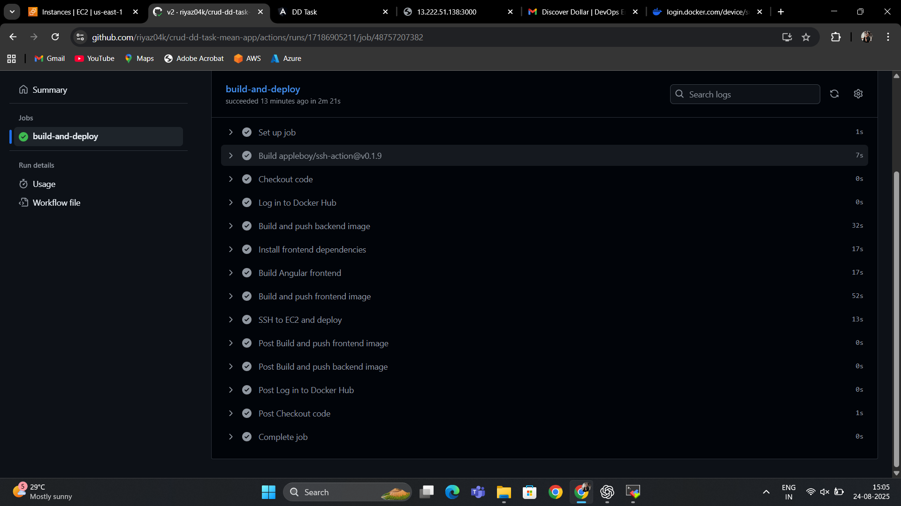
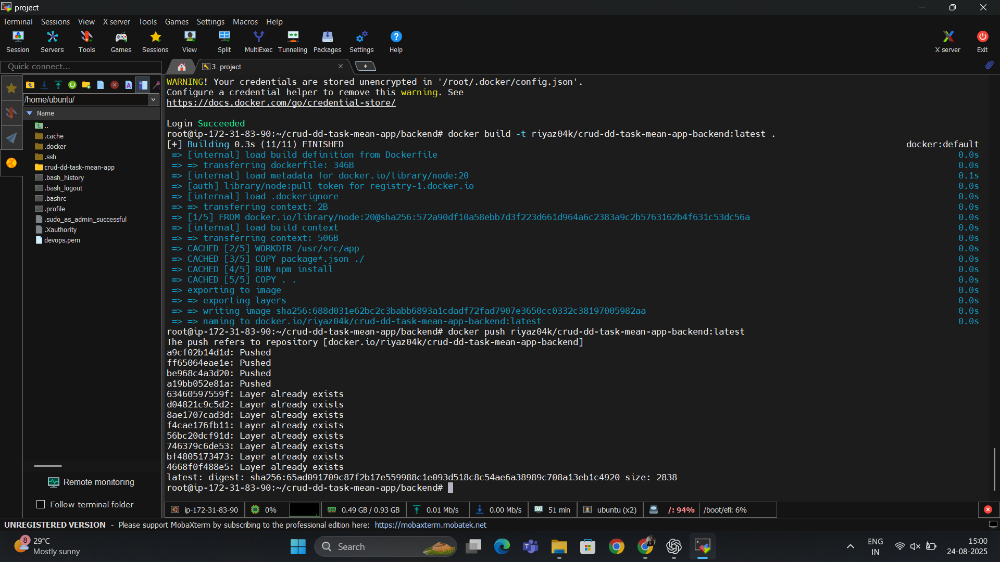
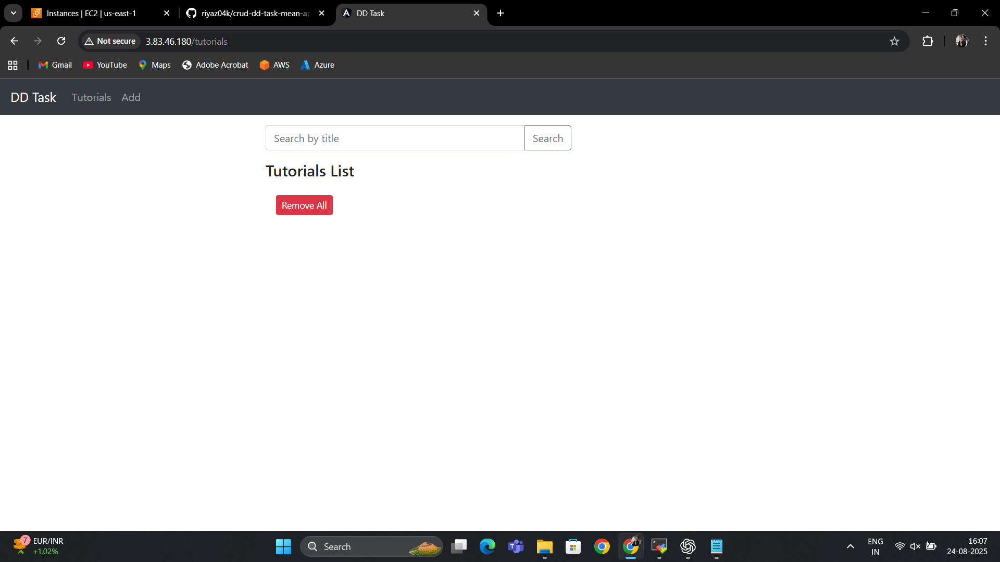
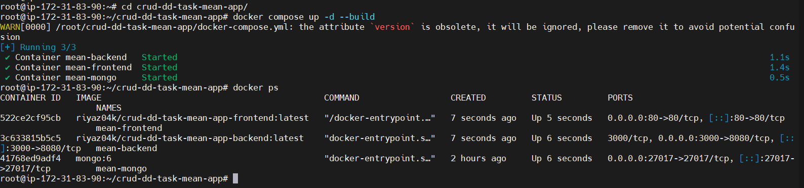
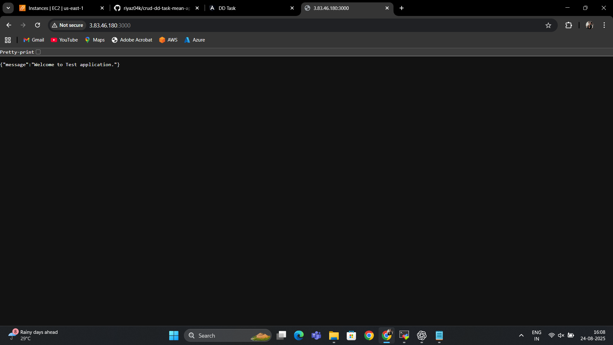
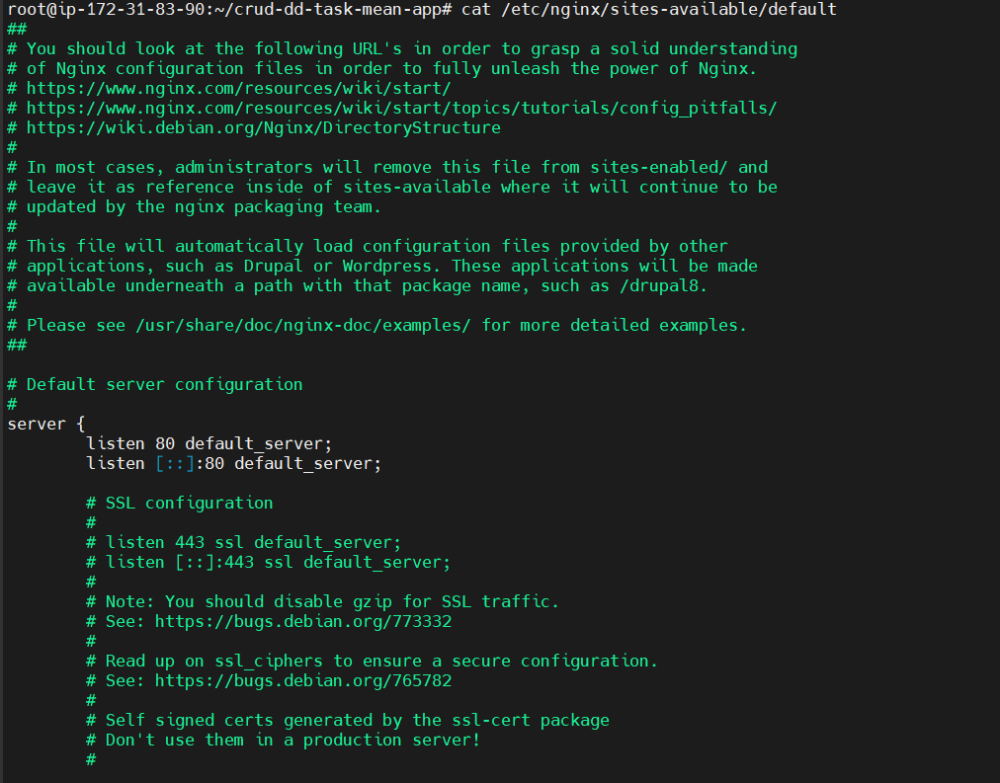
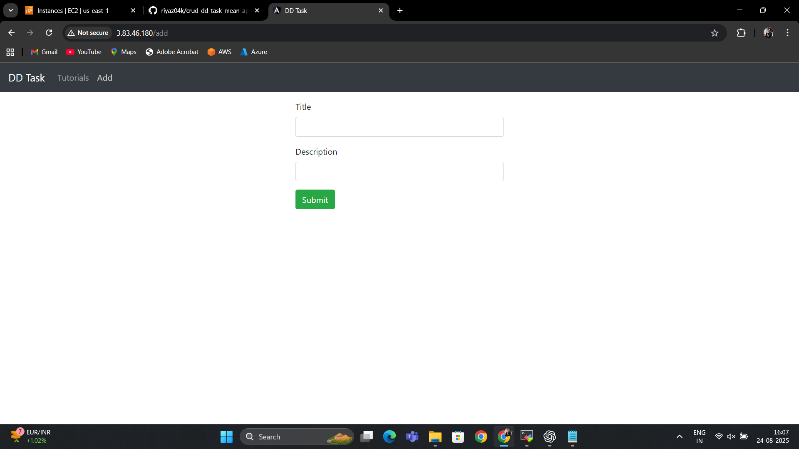

# 📌 CRUD MEAN App – CI/CD, Docker & Deployment  

## ✅ Project Overview  
This project is a **containerized MEAN stack CRUD application** deployed on **AWS EC2** with automated CI/CD pipelines using **GitHub Actions**.  

It demonstrates:  
- Full **Dockerization** of backend (Node.js/Express + MongoDB) and frontend (Angular + Nginx).  
- **CI/CD workflows** for automated builds, testing, and image pushes to Docker Hub.  
- **Deployment via Docker Compose** on EC2.  
- **Reverse proxy with Nginx** for frontend hosting and routing.  

---

## ⚙️ CI/CD Configuration  
GitHub Actions workflow (`.github/workflows/docker-deploy.yml`) handles:  
- Building backend & frontend images.  
- Pushing images to **Docker Hub**.  
- Optional deployment steps for EC2 using SSH + Docker Compose.  

📸 CI/CD Execution:  
  

---

## 🐳 Dockerization  
- **Backend**: Node.js service with MongoDB connection.  
- **Frontend**: Angular app built & served with Nginx.  
- **Docker Hub images**:  
  - `riyaz04k/crud-dd-task-mean-app-backend:latest`  
  - `riyaz04k/crud-dd-task-mean-app-frontend:latest`  

📸 Backend Build & Push:  
  

📸 Frontend UI:  
  

---

## 🚀 Deployment on AWS EC2  
Deployed with `docker-compose.yml`. Containers started successfully:  
- Backend (Port `3000`)  
- Frontend (Port `80`)  
- MongoDB  

📸 Docker Containers:  
  

📸 Backend Running:  
  

---

## 🌐 Nginx Setup  
Used as a **reverse proxy** for Angular build output.  

📸 Nginx Config:  
  

---

## 🎯 Working Application UI  
CRUD operations tested via Angular frontend.  

📸 Frontend Screens:  
  
  

---
## 📂 Repository Structure  

crud-dd-task-mean-app/
├── backend/ # Node.js backend API
├── frontend/ # Angular frontend
├── .github/workflows/ # GitHub Actions (CI/CD)
├── docker-compose.yml # Multi-container deployment
├── screenshots/ # Project deliverable screenshots
└── README.md # Documentation

---

✅ **Deliverables completed**:  
- CI/CD pipeline  
- Docker images build & push  
- AWS EC2 deployment  
- Working frontend + backend  
- Screenshots for documentation  
